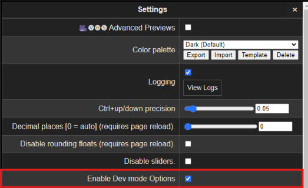

# AI MasterDream Copilot: AMD Enhanced Artistic Rendering System

This is a demo of AI MasterDream Copilot.

 
## Video Tutorial
Watch this tutorial to get started with the project:

[](https://www.youtube.com/watch?v=dQw4w9WgXcQ)

[](https://www.youtube.com/watch?v=8ONP7jlgQms&cc_load_policy=1&hl=en)

[Watch the  video](https://www.youtube.com/watch?v=8ONP7jlgQms&cc_load_policy=1&hl=en)
(Click the picture or link)

Due to the delay of shipping delivery and unexpectiable problem of power failures for three times and earthquake (rate: 5.7) on 8/15 near our places, the more videoes will upload as soon as possilbe!


## Abstract
This project uses AMD graphics cards and TensorFlow technology to achieve efficient image generation, reasoning, and text generation functions. The system uses Node-RED workflows for low-code control and runs edge computing on an Arduino development board. By combining Angular and Arduino APP, the conversational user interface design of multiple projects has been realized.


## Introduction of AI MasterDream Copilot

This project successfully implemented image generation, image reasoning, and text generation tasks on AMD graphics cards. The system leverages TensorFlow for accelerated inference and Node-RED workflows for low-code control and process management. Additionally, for edge computing on the Arduino development board, TensorFlow and TensorFlow Lite for Microcontrollers are used to perform edge computing and integrate related APIs.

In terms of user interface design, the system combines the integration of Angular and Arduino APP with Node-RED workflows to realize the dialogue design and management of multiple projects. The project was presented and evaluated in the AMD Hackathon competition at [Hackster.io](https://www.hackster.io/).

[Read more about AI MasterDream Copilot's story on the AMD Pervasive AI Developer Contest](https://www.hackster.io/ai-master-dream-copilot/)


## Basic Requirements

This project requires the following software versions:

- [Python](https://www.python.org/downloads/) version 3.10.6
- [Angular CLI](https://github.com/angular/angular-cli) version 18.0.1
- [Node-RED](https://github.com/node-red/node-red) version 4.0.2
- [Node.js](https://nodejs.org/en) version 22.2.0
- [LM Studio](https://lmstudio.ai/rocm) version 0.2.28
- [Stable Diffusion](https://github.com/lshqqytiger/stable-diffusion-webui-amdgpuversion) version v1.9.3
- [ComfyUI](https://github.com/patientx/ComfyUI-Zluda) version v2.3
- [ZLUDA](https://github.com/vosen/ZLUDA) version V3
- [HIP SDK](https://www.amd.com/en/developer/resources/rocm-hub/hip-sdk.html) versions V5.5.0, V5.7.0, V6.1.0
- [The latest AMD Radeon software Adrenalin](https://www.amd.com/zh-tw/support/download/drivers.html) version 24.7.1
- [Arduino_TensorFlowLite](https://github.com/tensorflow/tflite-micro-arduino-examples) version 0.0.1

## AI MasterDream Copilot Playground by Angular & Google Gemini AI & LOCAL LLM

Explore the AI MasterDream Copilot Playground built with Angular and Google Gemini AI.

[AI MasterDream Copilot Playground by Angular](https://github.com/waldolin/ai-playground-angular)

use your gemini key in \src\environments\environment.ts


## Demo

You can find the live demo on StackBlitz.

[StackBlitz Demo](https://stackblitz.com/~/github.com/waldolin/ai-playground-angular)

## Running Local LLM

This is a functional demo located in the `llm` folder, using LM Studio to run a local server on your PC and Android environment for chat. Try using our LoRA tuning model in Gemma 2B!

## Issues Related to Prompt Words Training


I have used the datasets of prompt words training with:
- 24 samples (6 samples each for 4 functions) to test the LoRA tuning model in Gemma 2B.
- 600 samples (60 samples each for 4 functions, including some prompts I designed before, and 10 samples each for 40 styles, covering prompt words generator of intelligent optimization, style transfer, and image enhancement).
- 5K samples (60 samples each for 4 functions and prompt words generator, plus 100 samples each for 40 styles).

- [10K and 110K Booru Tag Autocompletion for A1111 in Traditional Chinese, Japanese, and English](https://github.com/waldolin/a1111-sd-webui-tagcomplete-TW)

- [900k Diffusion Prompts Dataset](https://www.kaggle.com/datasets/tanreinama/900k-diffusion-prompts-dataset?select=diffusion_prompts.csv)

The dataset was divided into training, validation, and testing sets with a ratio of 70%/15%/15%.

Before fine-tunning the model, I try to increase the Label prediction accuracy step by step. I cleaned up the nsfw_content.  I have asked specialists of Google many times


As you can see the failure of picture, it will cost me around 4 hours to wait for labelling on the datasets and so on.  I have asked the specialist of Google who say sometime it will fail by tuning, and he suggest me to upload the model for in-app purchase or service by calling to pay.

I have trained the LoRA tuning model using "Gemma 2: 2B" and "Llama 3.1: 8B", as well as "Chinese Llama 3: TAIDE-LX-8B". Initially, I intended to use "Gemma 2: 9B", but due to the delay of shipping delivery and power failures for three times, I had no choice but to upload the LoRA tuning model in Gemma 2B with tears in my eyes.


I train the samples with colab on T4 16G for 2 hours,and it will train around 500 epochs.  It will run faster on AMD GPUs of W7900 on linux operating system.  It can not run on windows because of the tensorflow-text version is 2.10.1.  It is not supported for update on windows.  When fine-tunning the model, it need the version of keras>=3 ,tensorflow and tensorflow-text.
  

## Training Guide and Model Files

For detailed instructions on how to train the model using LORA tuning, please refer to the training guide provided in the following Jupyter Notebook:

- **Training Guide**: [lora_tuning.ipynb](./lora_tuning2_ipynb.ipynb)

### Model Files
- **Weight File**: `my_model_weights.weights`
- **LORA File**: `my_model_checkpoint_0001.keras`
                `my_model.h5`
- **dataset File**: `databricks-dolly-33.jsonl`

I have successfully combined the LORA file with the model. This integration allows for enhanced fine-tuning of the model's performance, providing more accurate results in specific tasks.


## Use Our LoRA Tuning Model


This is a demo for building a simple web service using Flask. Below is an example Python program that uses Flask to build an API so you can make model predictions through HTTP requests.

### Steps to Follow:

1. **Install Flask**: If you haven't installed Flask, you can do so by executing the following command:

    ```bash
    pip install flask
    ```

2. **Build a Flask Application**: Create a Python file, such as `app.py`, and add the following code to load the model and set up an API endpoint to receive prediction requests.

    Flask application code (`app.py`):

    ```python
    from flask import Flask, request, jsonify
    from tensorflow.keras.models import load_model

    app = Flask(__name__)

    # Load models
    model_h5 = load_model('my_model.h5')
    model_saved_model = load_model('my_saved_model')

    @app.route('/predict', methods=['POST'])
    def predict():
        data = request.json
        # Assume we receive a list of numbers as input features
        features = data['features']
        # Use my_model.h5 model for prediction
        prediction_h5 = model_h5.predict([features]).tolist()
        # Use my_saved_model model for prediction
        prediction_saved_model = model_saved_model.predict([features]).tolist()

        # Return prediction results
        return jsonify({
            'prediction_h5': prediction_h5,
            'prediction_saved_model': prediction_saved_model
        })

    if __name__ == '__main__':
        app.run(debug=True)
    ```


3. **Run the Flask Application**: Execute the following command in the terminal to start the Flask server:

    ```bash
    python app.py
    ```

   This starts the service on port 5000 on localhost.

4. **Making a Request Using Curl**: Open another terminal window and use `curl` to make a POST request as follows:

    ```bash
    curl -X POST -H "Content-Type: application/json" -d '{"features": [1.0, 2.0, 3.0]}' http://localhost:5000/predict
    ```

    This command sends a JSON object containing the features you want the model to predict.

    This setup allows you to make predictions from models saved in two different formats and easily make interface calls over the network.


## Or load our lora-tunning model on Lm studio to try our functions


choose the button "select a model to load" and choose our lora-tunning model


Download and put in the path of folder. Please check it like the path "C:\Users\"yourusername"\ .cache\lm-studio\models"


That will show in the model list and choose it!


import jsonl and use GPU acceleration by clicking GPU offload as MAX as you can.


## This is a demo of models of AI MasterDream Copilot.  If You Want to Run a whole Test, Make Sure You Install the Requirements


```bash
npm install -g --unsafe-perm node-red
npm install npm -g install
npm install @angular/cli@17.0.0
npm install @vue/cli@5.0.8
npm install create-react-app@5.0.1
npm install express@4.19.2
npm install http-server@14.1.1
npm install node-sd-webui@0.0.8
npm install npm@10.8.1
npm install vercel@29.3.3
npm install replicate@0.31.1
```

before running the demo, check the basic requirements
```python
node -version
python -version
```
Remember set -api on stable diffusion

```bash
set COMMANDLINE_ARGS=--api
```
Remember set -api on Comfyui by clicking the setting


Click ENABLE Dev Mode Options



If you use the chinese version, it is like this.


And use API format


To use AI MasterDream copilot to have fun!

If the version is conflict, it can not use API.

It will like this picutre of BUG.

Try to lower version or cancel update of start.bat


and Install the Requirement.txt attached at [AI MasterDream Copilot's in Hackster](https://www.hackster.io/ai-master-dream-copilot/)

Use NODERED with comfyui and stable diffusion in AI MasterDream copilot's app


If you have not installed the requirements, it will lack some nodes.


If you have installed the requirements, it will show up when importing jsonl.

set the deployment on the red button, check it on the dashboard. 


If you do not install the basic requirements or you do not open the stable duffsion with api, it will show a bug when generating.


What's the difference of AI MasterDream Copilot?
As you can see it, the difference of generating pictures.

THE Whole designed Demo of AI MasterDream Copilot
 
 
 

and Install APK released for cell phone or Raspberry Pi 4B with ours AOSP
[AOSP demo](https://drive.google.com/drive/folders/1DGVvx6CjEIN8CoiIwBtS4vgT126h_dfq?usp=sharing)
 This is an AOSP (Android 13) built for Raspberry Pi 4 Model B, Pi 400, and Compute Module 4. Running this version requires a Pi 4 model with at least 2GB of RAM. sd card needs 8GB.

```bash
sudo apt update
sudo apt full-upgrade
```
```bash 
<(curl -sL https://raw.githubusercontent.com/node-red/linux-installers/master/deb/update-nodejs-and-nodered)
```

```bash
sudo reboot

```


Last but not least,I must have Special thanks for AMD.
The AMD Pervasive AI Developer Contest was instrumental in the successful realization of this project. The platform, resources, and support it offered allowed us to not only launch and test our work but also to refine and enhance it. This contest fostered innovation, collaboration, and significant advancements in AI development. 

## Special thanks to
- AMD
- HACKSTER
- Kun-Neng Hung
- Liu Yuting
- Professor Gao Huantang
- Professor Chen Xinjia
- North Branch Maker Base (R.O.C) in Taiwan
- GDG Taipei and Taoyuan
- ML Paper Reading Club
- NTU AI CLUB